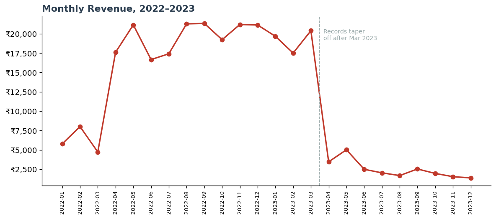

# Balaji Fast Food — Sales Analysis

Analysis of 1,000 orders from a fast-food stall (2022–2023) answering the questions a real owner would ask: **what sells, when it sells, how customers pay, and how the business is trending.** The project takes a messy public dataset from raw CSV all the way to a cleaned dataset, a documented analysis, an interactive dashboard, and a written business report.

> **Interactive dashboard:** [`dashboard/Balaji_Dashboard.html`](dashboard/Balaji_Dashboard.html) — download and open in a browser
> **Dataset:** [Balaji Fast Food Sales — Kaggle](https://www.kaggle.com/) · 1,000 orders

---

## Business questions

1. **What sells?** Which menu items drive the most revenue?
2. **When do we sell?** Which times of day and days of the week are busiest?
3. **How do people pay?** What's the cash vs. online split?
4. **How is the business trending?** What does monthly revenue look like over time?

## Tools used

- **Python** (pandas, matplotlib) — data cleaning and exploratory analysis
- **Jupyter Notebook** — documented, reproducible analysis
- **Interactive HTML dashboard** — self-contained, opens in any browser
- **Excel/CSV** — cleaned data output

---

## Key findings

| Question | Finding | Business takeaway |
|---|---|---|
| **What sells?** | Sandwich, Frankie & Cold coffee lead; together >50% of revenue. Vadapav & Aalopuri lag. | Never stock out of the top 3; review the laggards. |
| **When?** | Night is the peak, but every time slot sells well. Monday is strongest. | Staffing can stay steady — no dead shift. |
| **Payment?** | ~53% cash / 47% online (of recorded payments). | Support both; fix the 11% of orders with no payment logged. |
| **Trend?** | Steady ~₹20k/month in 2022; records drop sharply after March 2023. | Likely a **data-logging gap, not a sales crash** — fix data capture. |

**Headline numbers:** ₹275,230 total revenue · 8,162 items sold · ₹275 average order value.

### Monthly revenue trend



The most important analytical point in this project: revenue looks like it collapses after March 2023, but a ~90% overnight drop is almost certainly **under-recorded orders, not lost business.** A good analysis separates *what the data shows* from *what actually happened* — and the real action item is to fix how sales are logged.

---

## What the data needed before analysis

The raw file was small but messy. Three cleaning steps mattered:

- **Dates** were stored in two different formats (`07-03-2022` and `8/23/2022`) and had to be parsed consistently before any trend analysis.
- **Payment method** was missing on 107 orders (~11%). These were kept and labelled `Unknown` rather than deleted, and excluded only from the cash-vs-online split so it wouldn't be distorted.
- **Helper columns** (month, day-of-week, year) were derived from the date to support the time-based questions.

---

## Repository structure

```
balaji-fast-food-sales-analysis/
├── README.md
├── notebook/
│   └── Balaji_Fast_Food_Analysis.ipynb   # cleaning + analysis (start here)
├── data/
│   ├── Balaji Fast Food Sales.csv        # raw data
│   └── Balaji_cleaned.csv                # cleaned, analysis-ready
├── dashboard/
│   └── Balaji_Dashboard.html             # interactive dashboard
├── report/
│   ├── Balaji_Sales_Report.pdf           # written business report
│   └── Balaji_Sales_Report.docx          # editable source of the report
└── charts/
    └── *.png                             # exported visualizations
```

## How to reproduce

1. Clone this repo.
2. Install dependencies: `pip install pandas matplotlib jupyter`
3. Open `notebook/Balaji_Fast_Food_Analysis.ipynb` and run all cells. It reads the raw CSV, cleans it, and regenerates every chart.

---

## About

Built by **Aalaa Jandali** as a data-analytics portfolio project. I work front-of-house in a family restaurant, so these are the questions I'd genuinely want answered about a food business — and the project reflects how I'd approach them: clean the data carefully, answer the question plainly, and stay honest about what the numbers can and can't tell you.
